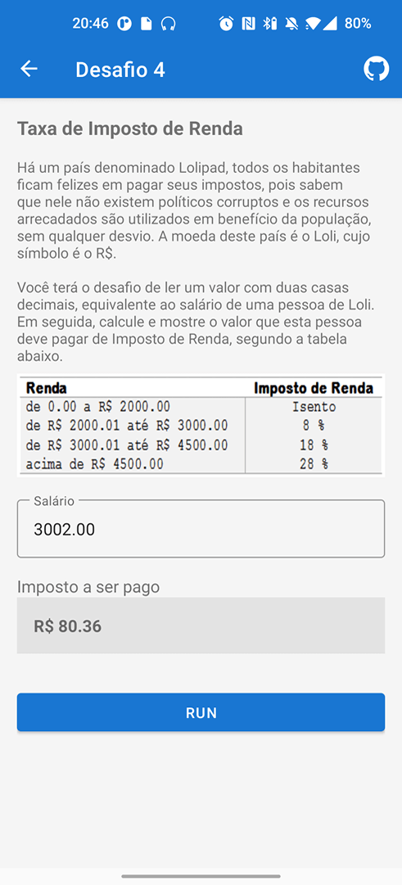
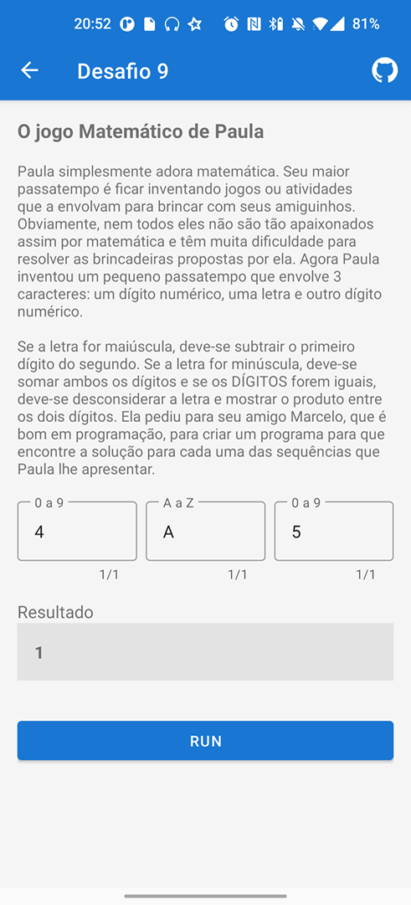
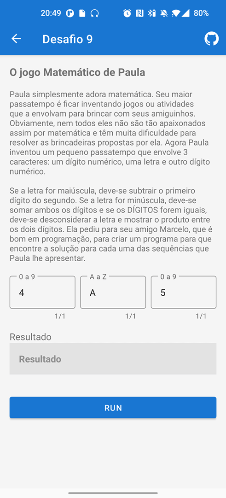
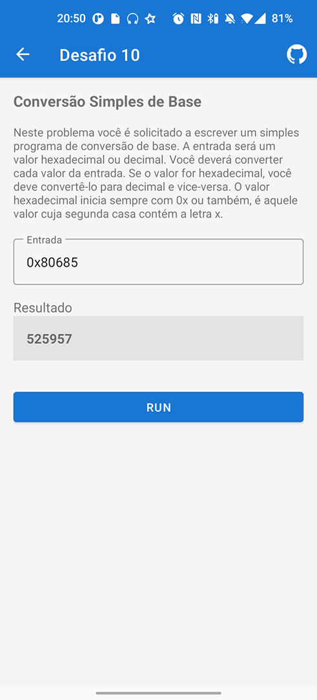
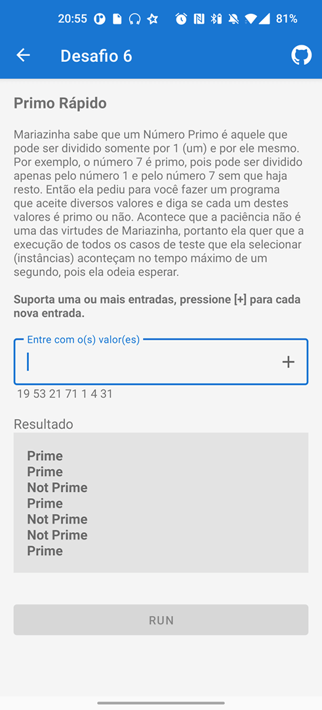
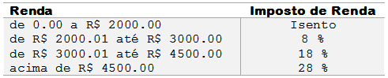
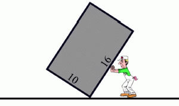
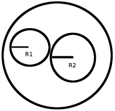

# Desafio Bootcamp everis Kotlin Developer
> Projeto baseado nos desafios do **Bootcamp everis Kotlin Developer**.

### Olá pessoal,

Gostaria de compartilhar algo com vocês, em especial aos que estão iniciando no desenvolvimento Android. Não sei quanto a vocês, mas eu sempre me perguntava na faculdade *"Como essa coisa feia, sem interface, poderia se tornar um software?"* 
Acredito que mais alguém já teve essa pira no início também rs. Este foi o meu primeiro Bootcamp na plataforma da DIO **Bootcamp everis Kotlin Developer** e quando iniciei os desafios me bateu uma nostalgia de quando eu passava horas tentando resolver os trabalhos da faculdade (bons tempos Eclipse + plugin ADT).

Pensando nisso, ao terminar os desafios propostos, resolvi implementar os 11 algoritmos em um projeto Android real para que os iniciantes possam ter uma noção de como ficaria essa implementação.

Nesse projeto, tentei seguir uma situação do mundo real, aplicando os conceitos abordados no Bootcamp, entre outros. Seguindo o raciocínio de como eu o faria, não quero dizer que é a melhor ou a única forma de se fazer, mas tentei abordar um pouco de como seria no dia a dia de um Desenvolvedor Android.

## O projeto tem como base

- Kotlin
- MVI (MVVM) Architecture (Arquitetura em uso:MVI Model View Intent qualquer atualização da IU é definida por um novo estado. Seria um componente a mais usado na arquitetura MVVM do que uma arquitetura propriamente dita.
- Dependency Injection (Hilt)
- View Binding
- Jetpack Navigation, Nav Controller
- Coroutine Scope, Flow
- ConstraintLayout, Flow
- Guidelines - Material Design

| DEASAFIO | NÍVEL | SOLUÇÃO |
| :--: | :--: | :--: |
| [Desafio 01](#anchor01) | Básico | [Lógica 01](app/src/main/java/fbo/costa/bootcampeveris/repository/RepositoryChallenge1.kt) |
| [Desafio 02](#anchor02) | Básico | [Lógica 02](app/src/main/java/fbo/costa/bootcampeveris/repository/RepositoryChallenge2.kt) |
| [Desafio 03](#anchor03) | Básico | [Lógica 03](app/src/main/java/fbo/costa/bootcampeveris/repository/RepositoryChallenge3.kt) |
| [Desafio 04](#anchor04) | Intermediário | [Lógica 04](app/src/main/java/fbo/costa/bootcampeveris/repository/RepositoryChallenge4.kt) |
| [Desafio 05](#anchor05) | Intermediário | [Lógica 05](app/src/main/java/fbo/costa/bootcampeveris/repository/RepositoryChallenge5.kt) |
| [Desafio 06](#anchor06) | Intermediário | [Lógica 06](app/src/main/java/fbo/costa/bootcampeveris/repository/RepositoryChallenge6.kt) |
| [Desafio 07](#anchor07) | Intermediário | [Lógica 07](app/src/main/java/fbo/costa/bootcampeveris/repository/RepositoryChallenge7.kt) |
| [Desafio 08](#anchor08) | Intermediário | [Lógica 08](app/src/main/java/fbo/costa/bootcampeveris/repository/RepositoryChallenge8.kt) |
| [Desafio 09](#anchor09) | Intermediário | [Lógica 09](app/src/main/java/fbo/costa/bootcampeveris/repository/RepositoryChallenge9.kt) |
| [Desafio 10](#anchor10) | Intermediário | [Lógica 10](app/src/main/java/fbo/costa/bootcampeveris/repository/RepositoryChallenge10.kt) |
| [Desafio 11](#anchor11) | Intermediário | [Lógica 11](app/src/main/java/fbo/costa/bootcampeveris/repository/RepositoryChallenge11.kt) |

 > ### [APK Download](https://github.com/F4bioo/BootcampEveris/raw/master/app/release/app-release.apk)

</img>
</img>
</img>
</img>
</img>
</img>

# Desafio 01 

### [voltar ao topo](#anchorTop)

Leia dois valores inteiros identificados como variáveis A e B. Calcule a soma entre elas e chame essa variável de SOMA.
A seguir escreva o valor desta variável.

## Entrada
O arquivo de entrada contém 2 valores inteiros.

## Saída
Imprima a variável SOMA com todas as letras maiúsculas, inserindo um espaço em branco antes e depois do símbolo de igualdade, seguido pelo valor correspondente à soma de A e B.

|  Exemplos de Entrada  |  Exemplos de Saída  |
|-----------------------|---------------------|
|        10             |      Soma = 40      |
|        20             |                     |

# Desafio 02
### [voltar ao topo](#anchorTop)

Leia um valor inteiro X (1 <= X <= 1000). Em seguida mostre os ímpares de 1 até X, um valor por linha, inclusive o X, se for o caso.

## Entrada
O arquivo de entrada contém 1 valor inteiro qualquer.

## Saída
Imprima todos os valores ímpares de 1 até X, inclusive X, se for o caso.

|  Exemplos de Entrada  |  Exemplos de Saída  |
|-----------------------|---------------------|
|           8           |         1           |
|                       |         3           |
|                       |         5           |
|                       |         7           |

# Desafio 03
### [voltar ao topo](#anchorTop)

Você terá o desafio de escrever um programa que leia um valor inteiro N (1 < N < 1000). Este N é a quantidade de linhas de saída que serão apresentadas na execução do programa.

## Entrada
O arquivo de entrada contém um número inteiro positivo N.

## Saída
Imprima a saída conforme o exemplo fornecido.

|  Exemplos de Entrada  |  Exemplos de Saída  |
|-----------------------|---------------------|
|           5           |       1 1 1         |
|                       |       2 4 8         |
|                       |       3 9 27        |
|                       |       4 16 64       |
|                       |       5 25 125      |

# Desafio 04
### [voltar ao topo](#anchorTop)

Há um país denominado Lolipad, todos os habitantes ficam felizes em pagar seus impostos, pois sabem que nele não existem políticos corruptos e os recursos arrecadados são utilizados em benefício da população, sem qualquer desvio. A moeda deste país é o Loli, cujo símbolo é o R$.

Lembre que, se o salário for R$ 3002.00, a taxa que incide é de 8% apenas sobre R$ 1000.00, pois a faixa de salário que fica de R$ 0.00 até R$ 2000.00 é isenta de Imposto de Renda. No exemplo fornecido (abaixo), a taxa é de 8% sobre R$ 1000.00 + 18% sobre R$ 2.00, o que resulta em R$ 80.36 no total. O valor deve ser impresso com duas casas decimais.
Você terá o desafio de ler um valor com duas casas decimais, equivalente ao salário de uma pessoa de Loli. Em seguida, calcule e mostre o valor que esta pessoa deve pagar de Imposto de Renda, segundo a tabela abaixo.

## Entrada
A entrada contém apenas um valor de ponto flutuante, com duas casas decimais.

## Saída
Imprima o texto "R$" seguido de um espaço e do valor total devido de Imposto de Renda, com duas casas após o ponto. Se o valor de entrada for menor ou igual a 2000, deverá ser impressa a mensagem "Isento".

|  Exemplos de Entrada  |  Exemplos de Saída  |
|-----------------------|---------------------|
|        3002.00        |      R$ 80.36       |
|        1701.12        |       Isento        |
|        4520.00        |      R$ 355.60      |

# Desafio 05
### [voltar ao topo](#anchorTop)

A fórmula para calcular a área de uma circunferência é: area = π . raio2. 

Considerando para este problema que π = 3.14159:

Efetue o cálculo da área, elevando o valor de raio ao quadrado e multiplicando por π.

## Entrada
A entrada contém um valor de ponto flutuante (dupla precisão), no caso, a variável raio.

## Saída
Apresentar a mensagem "A=" seguido pelo valor da variável area, conforme exemplo abaixo, com 4 casas após o ponto decimal. Utilize variáveis de dupla precisão (double). Como todos os problemas, não esqueça de imprimir o fim de linha após o resultado, caso contrário, você receberá "Presentation Error".

|  Exemplos de Entrada  |  Exemplos de Saída  |
|-----------------------|---------------------|
|         2.00          |    A=12.5664        |
|        100.64         |    A=31819.3103     |
|        150.00         |    A=70685.7750     |

# Desafio 06
### [voltar ao topo](#anchorTop)

Mariazinha sabe que um Número Primo é aquele que pode ser dividido somente por 1 (um) e por ele mesmo. Por exemplo, o número 7 é primo, pois pode ser dividido apenas pelo número 1 e pelo número 7 sem que haja resto. 

Então ela pediu para você fazer um programa que aceite diversos valores e diga se cada um destes valores é primo ou não. Acontece que a paciência não é uma das virtudes de Mariazinha, portanto ela quer que a execução de todos os casos de teste que ela selecionar (instâncias) aconteçam no tempo máximo de um segundo, pois ela odeia esperar.

## Entrada
A primeira linha da entrada contém um inteiro N (1 ≤ N ≤ 200), correspondente ao número de casos de teste. Seguem N linhas, cada uma contendo um valor inteiro X (1 < X < 231) que pode ser ou não, um número primo.

## Saída
Para cada caso de teste imprima a mensagem “Prime” (Primo) ou “Not Prime” (Não Primo), de acordo com o exemplo abaixo.

|   Exemplos de Entrada   |  Exemplos de Saída  |
|-------------------------|---------------------|
|           3             |                     |
|        123321           |     Not Prime       |
|          123            |     Not Prime       |
|          103            |       Prime         |

# Desafio 07
### [voltar ao topo](#anchorTop)

A corrida de tartarugas é um esporte que cresceu muito nos últimos anos, fazendo com que vários competidores se dediquem a capturar tartarugas rápidas, e treina-las para faturar milhões em corridas pelo mundo. 

Porém a tarefa de capturar tartarugas não é uma tarefa muito fácil, pois quase todos esses répteis são bem lentos. 

Cada tartaruga é classificada em um nível dependendo de sua velocidade:

- Nível 1: Se a velocidade é menor que 10 cm/h .
- Nível 2: Se a velocidade é maior ou igual a 10 cm/h e menor que 20 cm/h .
- Nível 3: Se a velocidade é maior ou igual a 20 cm/h .

Sua tarefa é identificar qual o nível de velocidade da tartaruga mais veloz de um grupo.

## Entrada
A entrada consiste de múltiplos casos de teste, e cada um consiste em duas linhas: A primeira linha contém um inteiro L (1 ≤ L ≤ 500) representando o número de tartarugas do grupo, e a segunda linha contém L inteiros Vi (1 ≤ Vi ≤ 50) representando as velocidades de cada tartaruga do grupo.

## Saída
Para cada caso de teste, imprima uma única linha indicando o nível de velocidade da tartaruga mais veloz do grupo.

|       Exemplos de Entrada         |  Exemplos de Saída  |
|-----------------------------------|---------------------|
|               10                  |                     |
|   10 10 10 10 15 18 20 15 11 10   |          3          |
|               10                  |                     |
|       1 5 2 9 5 5 8 4 4 3         |          2          |
|               10                  |                     |
|      19 9 1 4 5 8 6 11 9 7        |          1          |

# Desafio 08
### [voltar ao topo](#anchorTop)

Ricardo e Vicente são aficionados por figurinhas. Nas horas vagas, eles arrumam um jeito de jogar um “bafo” ou algum outro jogo que envolva tais figurinhas. 
Ambos também têm o hábito de trocarem as figuras repetidas com seus amigos e certo dia pensaram em uma brincadeira diferente. 
Chamaram todos os amigos e propuseram o seguinte: com as figurinhas em mãos, cada um tentava fazer uma troca com o amigo que estava mais perto seguindo a seguinte regra: cada um contava quantas figurinhas tinha. 

Em seguida, eles tinham que dividir as figurinhas de cada um em pilhas do mesmo tamanho, no maior tamanho que fosse possível para ambos. Então, cada um escolhia uma das pilhas de figurinhas do amigo para receber. 

Por exemplo, se Ricardo e Vicente fossem trocar as figurinhas e tivessem respectivamente 8 e 12 figuras, ambos dividiam todas as suas figuras em pilhas de 4 figuras (Ricardo teria 2 pilhas e Vicente teria 3 pilhas) e ambos escolhiam uma pilha do amigo para receber.

## Entrada
A primeira linha da entrada contém um único inteiro N (1 ≤ N ≤ 3000), indicando o número de casos de teste. Cada caso de teste contém 2 inteiros F1 (1 ≤ F1 ≤ 1000) e F2 (1 ≤ F2 ≤ 1000) indicando, respectivamente, a quantidade de figurinhas que Ricardo e Vicente têm para trocar.

## Saída
Para cada caso de teste de entrada haverá um valor na saída, representando o tamanho máximo da pilha de figurinhas que poderia ser trocada entre dois jogadores.

|  Exemplos de Entrada  |  Exemplos de Saída  |
|-----------------------|---------------------|
|           3           |                     |
|         8 12          |          4          |
|         9 27          |          9          |
|       259 111         |          37         |
# Desafio 09
### [voltar ao topo](#anchorTop)

Paula simplesmente adora matemática. Seu maior passatempo é ficar inventando jogos ou atividades que a envolvam para brincar com seus amiguinhos. Obviamente, nem todos eles não são tão apaixonados assim por matemática e têm muita dificuldade para resolver as brincadeiras propostas por ela. Agora Paula inventou um pequeno passatempo que envolve 3 caracteres: um dígito numérico, uma letra e outro dígito numérico.

Se a letra for maiúscula, deve-se subtrair o primeiro dígito do segundo. Se a letra for minúscula, deve-se somar ambos os dígitos e se os DÍGITOS forem iguais, deve-se desconsiderar a letra e mostrar o produto entre os dois dígitos. Ela pediu para seu amigo Marcelo, que é bom em programação, para criar um programa para que encontre a solução para cada uma das sequências que Paula lhe apresentar.

## Entrada
A entrada contém vários casos de teste. A primeira linha da entrada contém um inteiro N, indicando o número de casos de teste que virão a seguir. Cada caso de teste é uma sequência de três caracteres criada por Paula. Esta sequência contém na primeira posição um caractere de '0' a '9', na segunda posição uma letra maiúscula ou minúscula do alfabeto e na terceira posição outro caractere de '0' a '9'.

## Saída
Para cada caso de teste, deve ser impressa uma linha com um valor inteiro que representa a solução da sequência proposta por Paula.

|  Exemplos de Entrada   |  Exemplos de Saída  |
|------------------------|---------------------|
|           5            |                     |
|          4A5           |          1          |
|          3A3           |          9          |
|          4F2           |          6          |
|          2G4           |          2          |
|          7Z1           |          -6         |
# Desafio 10
### [voltar ao topo](#anchorTop)

Neste problema você é solicitado a escrever um simples programa de conversão de base. A entrada será um valor hexadecimal ou decimal. Você deverá converter cada valor da entrada. Se o valor for hexadecimal, você deve convertê-lo para decimal e vice-versa. O valor hexadecimal inicia sempre com “0x” ou também, é aquele valor cuja segunda casa contém a letra 'x'.

## Entrada
A entrada contém vários casos de teste. Cada linha de entrada, com exceção da última, contém um número não-negativo, decimal ou hexa. O valor decimal será menor ou igual a 231. A última linha contém um número negativo que não deve ser processado, indicando o encerramento do programa.

## Saída
Para cada linha de entrada (exceto a última) deve ser produzido uma linha de saída. Todo número hexadecimal deve ser precedido na saída por '0x' (zero xis).

|  Exemplos de Entrada  |  Exemplos de Saída  |
|-----------------------|---------------------|
|           4           |         0x4         |
|           7           |         0x7         |
|          44           |         0x2C        |
|       0x80685         |         525957      |
|         -1            |                     |
# Desafio 11
### [voltar ao topo](#anchorTop)

Você tem em mãos dois cabos circulares de energia. O primeiro cabo tem raio R1 e o segundo raio R2. Você precisa comprar um conduite circular (veja a imagem abaixo que ilustra um conduite) de maneira a passar os dois cabos por dentro dele:

Qual o menor raio do conduite que você deve comprar? Em outras palavras, dado dois círculos, qual o raio do menor círculo que possa englobar ambos os dois?

## Entrada
Na primeira linha teremos um inteiro T (T ≤ 10000), indicando o número de casos de teste.

Na única linha de cada caso teremos dois números inteiros R1 e R2, indicando os respectivos raios. Os inteiros serão positivos e todas as contas caberão em um inteiro normal de 32 bits.

## Saída
Em cada caso, imprima o menor raio possível em uma única linha

|  Exemplos de Entrada  |  Exemplos de Saída  |
|-----------------------|---------------------|
|           3           |                     |
|          1 1          |         2           |
|          2 8          |         10          |
|          8 2          |         10          |